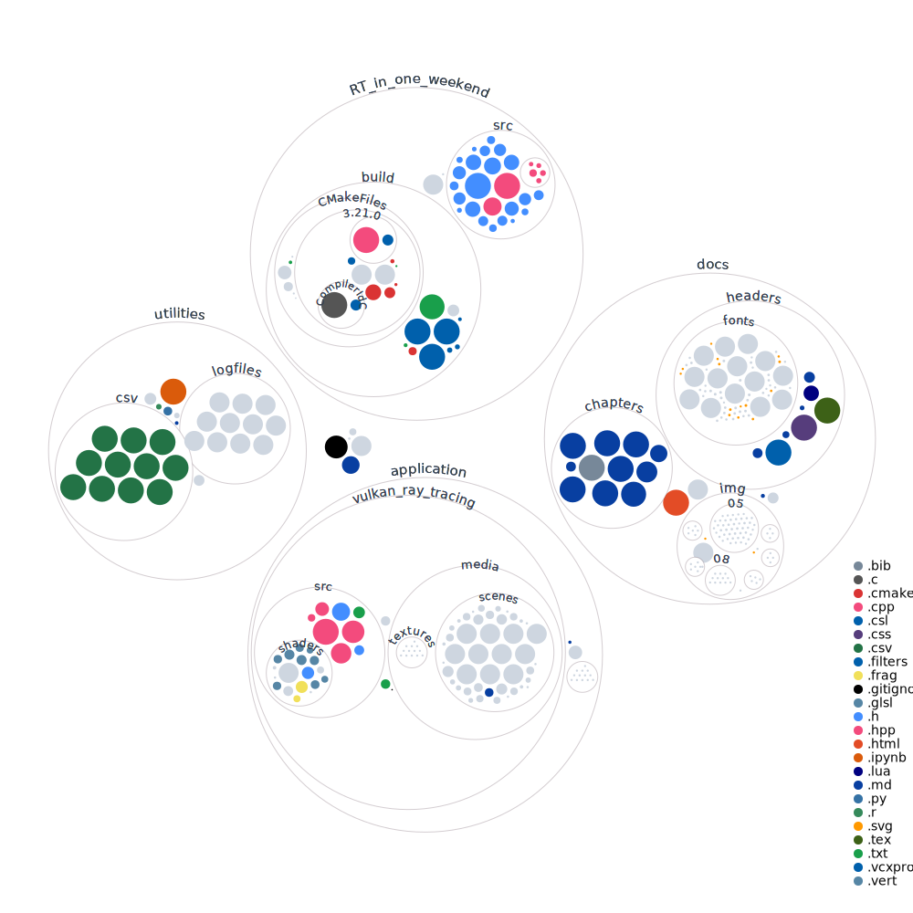

<h1 align=center>🔦 Un TFG sobre Raytracing 🔦</h1>

<div align=center>
  <h3>
    <a href="https://asmilex.github.io/Raytracing">:small_orange_diamond: ¡Visita la documentación online! :small_orange_diamond:</a>
  </h3>
</div>

<br>

<div align=center>
  
  
</div>

<hr>


<p align="center" dir="auto">
  <a href="#bulb-y-esto-de-qu%C3%A9-va-exactamente">Sobre el proyecto</a> •
  <a href="#gear-instalaci%C3%B3n">Instalación</a> •
  <a href="#evergreen_tree-estructura-del-repositorio">Estructura</a> •
  <a href="#handshake-contribuyendo">Contribuyendo</a> •
  <a href="#link-enlaces-de-inter%C3%A9s">Enlaces de interés</a>
</p>

<div align=center>
  
  <p align=center><i>En el futuro, esto será una foto mucho más chula</i></p>
</div>

## :bulb: Y esto, ¿de qué va exactamente?

Este repositorio contiene una implementación del ray tracer de Peter Shirley en VkRay, así como la documentación asociada al desarrollo.

Ah, también es el trabajo de fin de grado de mi doble grado en Ingeniería Informática y Matemáticas 🎓.

Actualmente se encuentra en una fase temprana de desarrollo. Con un poco de suerte, ¡debería estar listo para verano de 2022!

## :gear: Instalación

Requiere tener Vulkan instalado, un driver de Nvidia compatible con Vulkan, Cmake.

Clona este repositorio con `git clone --recursive --shallow-submodules https://github.com/Asmilex/Raytracing.git`.

Para construir el motor, hace falta lo siguiente:

```
cd .\application\vulkan_ray_tracing\
mkdir build
cd build
cmake ..
```

Cuando se haya ejecutado, deberían haber aparecido los makefiles necesarios. Si abres VSCode, en la pestaña de *Run and Debug*, deberías tener una opción para lanzar Asmiray. Debería ir.

## :evergreen_tree: Estructura del repositorio

A fecha 2022-01-31,  el repositorio está compuesto por los siguientes directorios:

- [`./docs`](./docs): Documentación del proyecto. Toda la documentación está basada en markdown. Para convertirla en PDF y desplegarla en la web, se utiliza Pandoc. Tienes más información en el [README](./docs/README.md) correspondiente.
- [`./RT_in_one_weekend`](./RT_in_one_weekend): Código del ray tracer de la [serie de libros de Shirley](https://raytracing.github.io/) original en CPU.
- [`./application`](./application): El futuro ray tracer en GPU se ubicará aquí. Ahora mismo está en pañales.




## :handshake: Contribuyendo

### :open_book: Github Projects

Puedes acceder a [Github Projects](https://github.com/users/Asmilex/projects/2) para ver la gestión de las tareas. Resulta especialmente útil para saber en lo que se está trabajando actualmente.

### :eyeglasses: Guía de estilo

Cada commit debería ir identificado con un emoji antes del mensaje, así como terminar en un issue enlazado. Por ejemplo, `[📓] Descripción de función de densidad (#71)`

Estos son los iconos usados, así como su significado:

| Tipo de commit           |         Emoji         | Cómo se escribe rápidamente |
|:-------------------------|:---------------------:|:---------------------------:|
| Documentación            |      :notebook:       |        `:notebook:`         |
| Archivo de configuración |       :wrench:        |         `:wrench:`          |
| Integración continua     | :construction_worker: |   `:construction_worker:`   |
| Quitar archivos          |        :fire:         |          `:fire:`           |
| Nuevas características   |      :sparkles:       |        `:sparkles:`         |
| Test                     |       :alembic:       |         `:alembic:`         |
| Refactorización          |       :recycle:       |         `:recycle:`         |
| Bugfix                   |         :bug:         |           `:bug:`           |


Los issues también deberían seguir el mismo estilo. Tienes un ejemplo [aquí](https://github.com/Asmilex/Raytracing/issues/4)


## :link: Enlaces de interés

En esta sección se recopilan enlaces útiles para el desarrollo del motor. Se irá actualizando conforme avance.

*(Y, seguramente, desaparezca en el futuro)*

### Implementaciones y tutoriales

- [Libros de Shirley](https://raytracing.github.io/)
- [Nvidia Vulkan Ray Tracing tutorial](https://nvpro-samples.github.io/vk_raytracing_tutorial_KHR/). Parte desde un proyecto básico de Vulkan, y añade lo necesario para tener aceleración de RT usando el framework nvpro-samples. Interesante cuanto menos, y una de las opciones más seguras. Se basa en el código de [este repositorio](https://github.com/nvpro-samples/vk_raytracing_tutorial_KHR).
- En la misma línea, una [implementación de In One Weekend](https://github.com/GPSnoopy/RayTracingInVulkan) con esas extensiones por GPSsnoopy. Podría resultar muy útil también
- [Un mini path tracer](https://github.com/nvpro-samples/vk_mini_path_tracer). Referenciado en Gems II.
- [Vulkan Samples](https://github.com/KhronosGroup/Vulkan-Samples).
- [Tutorial de Vulkan](https://vulkan-tutorial.com/Introduction)
- [Lista con recursos de RT](https://www.realtimerendering.com/raytracing.html)
- [ImGui, una librería de de GUI para C++](https://github.com/ocornut/imgui). Convenientemente, tiene un ejemplo para [integrarlo con Vulkan y GLFW](https://github.com/ocornut/imgui/blob/master/examples/example_glfw_vulkan/main.cpp). Podría ser un gran punto de partida.
- [Vulkan base](https://github.com/kennyalive/vulkan-base), una simple aplicación de Vulkan para renderizar modelos 3D. Parece una implementación del punto anterior. Además, enlaza a [Vulkan Raytracing](https://github.com/kennyalive/vulkan-raytracing), del mismo autor.
- Sobre Cmake y vcpkg:
  - [Tutorial pequeño](https://www.40tude.fr/how-to-use-vcpkg-with-vscode-and-cmake/)
  - [Sistema automatizado](https://cpptruths.blogspot.com/2019/03/bootstrapping-vcpkg-based-cmake-project.html)
  - [Blog 101](https://gamefromscratch.com/vcpkg-cpp-easy-mode-step-by-step-tutorial/)
  - [Otro blog 101](https://sam.elborai.me/blog/vscode-cpp-dev-environment-2020)

### Conocimiento

- [Physically Based Rendering](http://www.pbr-book.org/)
- [Libro sobre métodos de Monte Carlo](http://statweb.stanford.edu/~owen/mc/)
- [Arquitectura de Turing](https://developer.nvidia.com/blog/nvidia-turing-architecture-in-depth/)
- [Explicación interesante sobre GI de Digital Foundry](https://www.youtube.com/watch?v=yEkryaaAsBU)
- [Ray Tracing Gems I](https://www.realtimerendering.com/raytracinggems/rtg/index.html)
- [Ray Tracing Gems II](https://developer.nvidia.com/ray-tracing-gems-ii)
