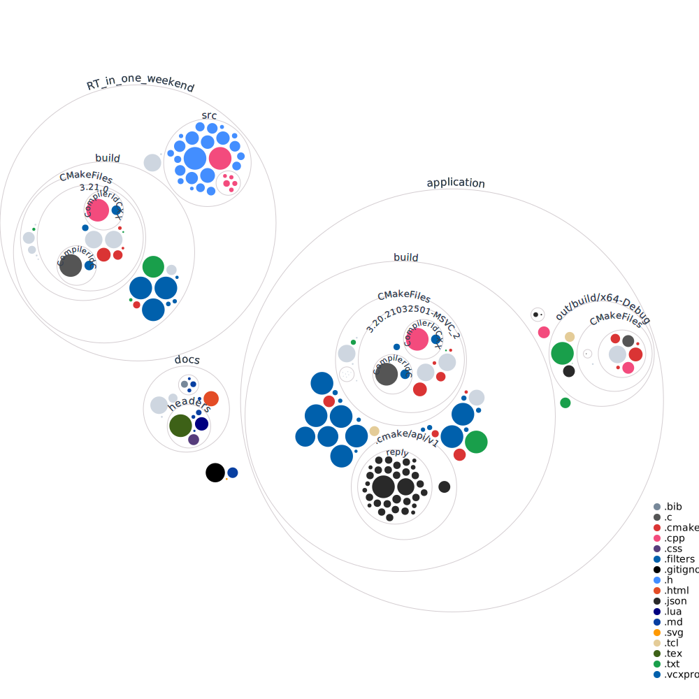

# TFG_RT_VkRay
Implementación del ray-tracer de Peter Shirley en VkRay para el Trabajo de Fin de Grado de mi doble grado en Ingeniería Informática y Matemáticas en la UGR.

## Enlaces de interés

En esta sección se recopilan enlaces útiles para el desarrollo del motor. Se irá actualizando conforme avance.

- [Libro de Shirley](https://raytracing.github.io/)
- [Tutorial de Nvidia de VkRay](https://nvpro-samples.github.io/vk_raytracing_tutorial_KHR/)
- [Arquitectura de Turing](https://developer.nvidia.com/blog/nvidia-turing-architecture-in-depth/)
- [Nvidia designworks RT tutorial](https://github.com/nvpro-samples/vk_raytracing_tutorial_KHR)
- [Libro de Shirley implementado en NvVkRay](https://github.com/GPSnoopy/RayTracingInVulkan)
- [Métodos de Monte Carlo](http://statweb.stanford.edu/~owen/mc/)
- [Physically Based Rendering](http://www.pbr-book.org/)
- [Template de Latex ClassicThesis](https://bitbucket.org/amiede/classicthesis/downloads)
- [Lista con recursos de RT](https://www.realtimerendering.com/raytracing.html)
- [Tutorial de Vulkan](https://vulkan-tutorial.com/Introduction)
- [Vulkan con CMake](https://vulkan.lunarg.com/doc/view/1.1.108.0/windows/getting_started.html)
- [Explicación interesante sobre GI](https://www.youtube.com/watch?v=yEkryaaAsBU)
- [Ray Tracing Gems II](https://developer.nvidia.com/ray-tracing-gems-ii)

## Temas de interés e investigación

- Ruido Perlin.
- Estructura Bounding Volume Hierarchy.

## Log

### 2021/08/21.

- RT: The rest of your life completado.
- La aplicación ha sido pausada. Esperaré a que se reanude el curso.
- Debemos plantear si merece la pena usar algo de la implementación de Shirley.

### 2021/07/16
- Inicio desarrollo de RT in one weekend.

### 2021/07/12

- Intento finalizar el cmake
  - Hace falta compilar con `cmake -A x64` para las builds de 64, o usar desde la línea de comandos `cmake --build .`. (https://vulkan.lunarg.com/doc/view/1.1.108.0/windows/getting_started.html)
- Día poco productivo; me estanco con la creación del proyecto de Vulkan.

### 2021/07/11

- Implemento proyecto basándome en Cmake y vcpkg:
  - Lista de recursos:
    - [Tutorial pequeño](https://www.40tude.fr/how-to-use-vcpkg-with-vscode-and-cmake/)
    - [Sistema automatizado](https://cpptruths.blogspot.com/2019/03/bootstrapping-vcpkg-based-cmake-project.html)
    - [Blog 101](https://gamefromscratch.com/vcpkg-cpp-easy-mode-step-by-step-tutorial/)
    - [Otro blog 101](https://sam.elborai.me/blog/vscode-cpp-dev-environment-2020)
  - Requisitos:
    - Microsoft compiler CL (build tools) (https://visualstudio.microsoft.com/es/downloads/)
    - Git
    - Cmake (https://cmake.org/)
  - Creo proyecto que automatiza la descarga de vcpkg, basándome en el tutorial del sistema automatizado.

FIXME terminar documentación
- Entorno de desarrollo basándose en el tutorial de Vulkan
  - VS2019 https://visualstudio.microsoft.com/es/
  - Vulkan SDK https://vulkan.lunarg.com/ instaladas en C:\V
  - GLFW https://www.glfw.org/download.html binarios precompilados, ubicados en User\Documentos\Visual Studio 2019\Libraries\GLFW
  - GLM https://github.com/g-truc/glm ubicado en User\Documentos\Visual Studio 2019\Libraries\GLM
