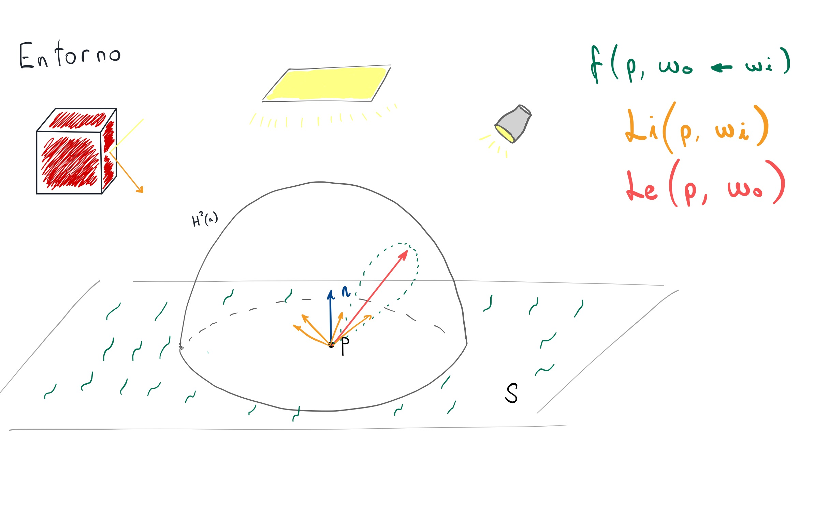

# ¿Cómo se renderiza una imagen por ordenador?

```{r setup, include=FALSE}
library(RefManageR)
BibOptions(
  check.entries = FALSE,
  #bib.style = "authoryear",
  cite.style = "numeric",
  style = "markdown",
  hyperlink = FALSE,
  dashed = FALSE
)
bib <- ReadBib("../chapters/bibliography.bib", check = TRUE)
```

**Rasterización**: proyecta la geometría de la escena en una malla bidimensional de píxeles.

.center[
```{r, echo = FALSE, out.width = "600px"}
knitr::include_graphics("./img/rasterizacion.gif")
```
]

---

.pull-left[
## Ventajas

- Computacionalmente **muy barato**.
- Gran conocimiento por parte de la industria.
]

--

.pull-right[
  ## Donde falla

  - Increíblemente limitado.
  - Genera **imágenes físicamente poco realistas**: no puede calcular iluminación, reflejos, etc. con facilidad.

  $\rightsquigarrow$ necesidad de crear *hacks*.
]

--

.pull-left[

¿Sombra?
]
.pull-right[


¿Reflejos?
]

---
class:inverse middle center

# Ray tracing al rescate

---

# ¿Qué es ray tracing?

En vez de proyectar la geometría, lanza rayos y hazlos impactar con los objetos de la escena.

En cada impacto, obtén información del objeto y su entorno.

.center[
```{r, echo = FALSE, out.width = "600px"}
knitr::include_graphics("../img/01/Ray casting.png")
```
]

---

# Path tracing

Una forma de ray tracing recursivo. Tras cada impacto, sigue generando rayos recursivamente.


---
class: center middle

# La ecuación del transporte de luz

$$L_o(p, \omega_o) = L_e(p, \omega_o) + \int_{H^2(\mathbf{n})}{f(p, \omega_o \leftarrow \omega_i) L_i(p, \omega_i) \cos\theta_i\ d\omega_i}$$



---
class:inverse center middle

# Un poco de radiometría

---

# Ángulos sólidos


---

# Radiancia

$$L(p, \omega) = \frac{d^2\Phi(p, \omega)}{d\omega\ dA^\bot} = \frac{d^2\Phi(p, \omega)}{d\omega\ dA\ \cos\theta}$$


---

# Funciones de distribución bidireccionales

### Reflectancia (_**B**idirectional **R**eflectance **D**istribution **F**unction_)

$$f_r(p, \omega_o \leftarrow \omega_i) = \frac{dL_o(p, \omega_o)}{dE(p, \omega_i)} = \frac{dL_o(p, \omega_o)}{L_i(p, \omega_i) \cos\theta_i\ d\omega_i} (\text{sr}^{-1})$$

### Transmitancia (_**B**idirectional **T**ransmittance **D**istribution **F**unction_)

$$f_t(p, \omega_o \leftarrow \omega_i)$$

### Combinándolas (_**B**idirectional **S**cattering **D**istribution **F**unction_)

$$f(p, \omega_o \leftarrow \omega_i)$$

---

# Reflexión y refracción

.pull-left[
- **Difusos** (*Diffuse*): luz en todas direcciones casi equiprobablemente.
- **Especulares brillantes** (*Glossy specular*): la distribución de luz es un cono.
- **Especulares perfectos** (*Perfect specular*): espejos.
- **Retrorreflectores** (*Retro reflective*): luz reflejada en dirección contraria.
]
.pull-right[
    
]

Debería meter aquí algunas imágenes guapas de los objetos.

---
class: inverse center middle

# Monte Carlo al rescate

---

Queremos calcular

$$I = \int_S f(x) dx$$

con $f: S\subset \mathbb{R}^d \rightarrow \mathbb{R}$.

--

Generalmente $I$ no resulta fácil de calcular.

--

.right[(Como la _rendering equation_)]

--

Los estimadores de Monte Carlo nos pueden ayudar a estimar su valor.

---

# Fundamento teórico

En esencia, esta teoría se basa en dos teoremas:

--

- **Ley del estadístico insconciente**: $X \sim p_X$ variable aleatoria, $g$ función medible

$$E\left[g(X)\right] = \int_{-\infty}^{\infty}{g(x) p_X(x) dx}$$

--

- **Ley (fuerte) de los grandes números**: $X_1, \dots, X_N$ muestras de una v.a. $X \sim p_X$ con esperanza $E[X] = \mu$

$$P\left[\lim_{N \to \infty}{\frac{1}{N} \sum_{i = 1}^{N}{X_i}} = \mu \right] = 1$$

--

(Y como siempre, el **Teorema Central del Límite**).

---

# Vale, ¿y cómo lo hacemos?

Queremos evaluar $I = \int_a^b{f(x)dx}$.

--

Por la ley ley del estadístico inconciente, $E\left[g(X)\right] = \int_{a}^{b}{g(x) p_X(x) dx}$.

--

Dicha esperanza puede estimarse como $E\left[g(X)\right] \approx \frac{1}{N} \sum_{i = 1}^{N}{g(X_i)} =: \hat{I}_N$.

--

Poniendo $g(x) = \frac{f(x)}{p_X(x)}$ con $p_X(x) = \frac{1}{b - a}$ función de densidad uniforme.

--

Obtenemos que

$$I = \int_{a}^{b}{\frac{f(x)}{p_X(x)}p_X(x) dx}$$

--

Y por lo tanto,

$$I \approx \frac{1}{N} \sum_{i = 1}^{N}{\frac{f(X_i)}{p_X(X_i)}} = \frac{b-a}{N}\sum_{i = 1}^{N}{f(X_i)}$$

--

El estimador funciona en cualquier dimensión.

---

# Error del estimador

Propiedad del estimador de Monte Carlo:

$$\text{error} = \sqrt{Var\left[\hat{I}_N\right]} = \frac{\sqrt{Var\left[g(X)\right]}}{\sqrt{N}}$$

¡No depende de la dimensión del integrando!

--

Posibilidades para reducir el error:

--

**1. Aumentar el número de muestras** $N$.

--

$\rightsquigarrow$ Para reducir el error a la mitad, habría que tomar 4 veces más muestras.

--

**2. Reducir** $Var\left[g(X)\right]$.

--

$\rightsquigarrow$ Muestreo por importancia: buscar funciones de densidad $p_X(x)$ cercanas a $f(x)$.

---

class:inverse middle center
# Path tracing

---

# ¿Qué es path tracing?

Una forma de ray tracing recursivo

--

En cada punto se debe estimar el valor de la _rendering equation_:

--


$$\begin{aligned}
L(p, \omega_o) & = L_e(p, \omega_o) + \int_{H^2(\mathbf{n})}{f(p, \omega_o \leftarrow \omega_i)L_i(p, \omega_i)\cos\theta_i} d\omega_i \\
                 & \approx L_e(p, \omega_j) + \frac{1}{N} \sum_{j = 1}^{N}{\frac{f(p, \omega_o \leftarrow \omega_j) L_i(p, \omega_j) \cos\theta_j}{P\left[\omega_j\right]}}
\end{aligned}$$

--

- Muestrear una dirección $\omega_j$ dependiendo de las propiedades del material.

--

- $L(p, \omega)$: cantidad de luz en un punto $p$.

--

- $L_e(p, \omega_o)$: cantidad de luz emitida desde $p$ en la dirección $\omega_o$.

--

- $f(p, \omega_o \leftarrow \omega_i)$: BSDF.. Distribución de la luz que va desde $\omega_i$ hacia $\omega_o$.

--

- $\cos\theta_i = \left \vert \omega_i \cdot \mathbf{n} \right \vert$.

--

- $P\left[\omega_j \right]$: Probabilidad de escoger la dirección $\omega_j$.

---
class: inverse middle center

# Construyendo un path tracer en tiempo real

---

# ¿Qué necesitamos?

.pull-left[
- Una gráfica de última generación.

$\quad \rightsquigarrow$ Nvidia RTX 2070 Super.
]
.pull-right[
```{r, echo = FALSE, out.width = "270px"}
knitr::include_graphics("./img/2070S.png")
```
]

--

.pull-left[
- Una API que soporte dicha gráfica.

$\quad\rightsquigarrow$ Vulkan con KHR bindings.
]
.pull-right[
```{r, echo = FALSE, out.width = "320px"}

```
]

--

.pull-left[
- Un framework para facilitarnos el trabajo.

$\quad\rightsquigarrow$ Nvidia DesignWorks `nvpro-samples`.
]
.pull-right[
```{r, echo = FALSE, out.width = "350px"}
knitr::include_graphics("./img/DesignWorks.png")
```
]

---

# Cómo funciona ray tracing acelerado por hardware

- La geometría se carga en la GPU gracias a la API.
- Los cálculos de intersecciones se aceleran mediante ciertas **estructuras**.
- Controlados por **shaders**

--

## Shaders

Programa que corre en la tarjeta gráfica.

--

Tipos:

- **Ray generation**: inicio de los caminos de rayos.
- **Closest hit**: en la primera intersección con una geometría válida.
- **Any hit**: en cualquier intersección.
- **Miss**: el rayo se pierde en el infinito.

---
class: middle center

# La **Shader Binding Table**


---
class: inverse middle center

# Exhibición de ray tracing

---

class: middle center

# El programa


---

# Iluminación global

Fotones rebotando en una habitación influencian al entorno.

<video controls autoplay muted loop>
  <source src="./img/GI.mov" type="video/mp4">
</video>

---

# Número de muestras

Dispara $N$ rayos por píxel y combina el resultado.

<video controls autoplay muted loop>
  <source src="./img/Muestras.mov" type="video/mp4">
</video>

---

# Profundidad máxima de un rayo

Rebotes máximos permitidos.

<video controls autoplay muted loop>
  <source src="./img/Depth.mov" type="video/mp4">
</video>

---

# Acumulación temporal

Mezclar los últimos frames mientras la cámara no esté en movimiento.

<video controls autoplay muted loop>
  <source src="./img/Acum.mov" type="video/mp4">
</video>
---
class: middle center

Fin.

---

# References

```{r, results='asis', echo=FALSE}
PrintBibliography(bib)
```
