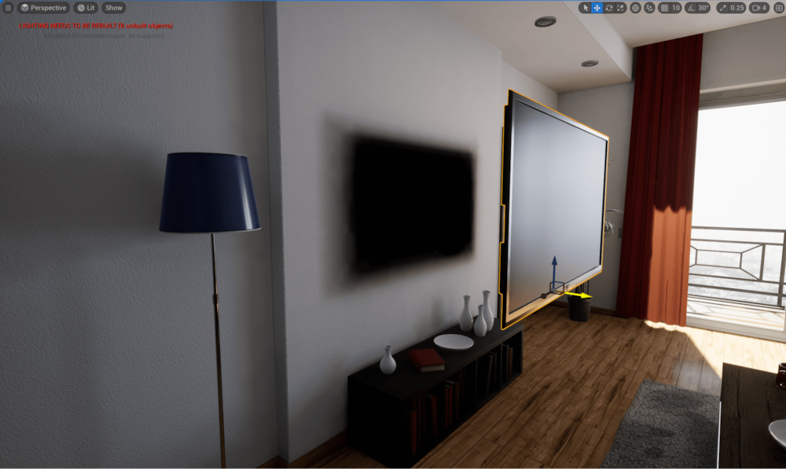
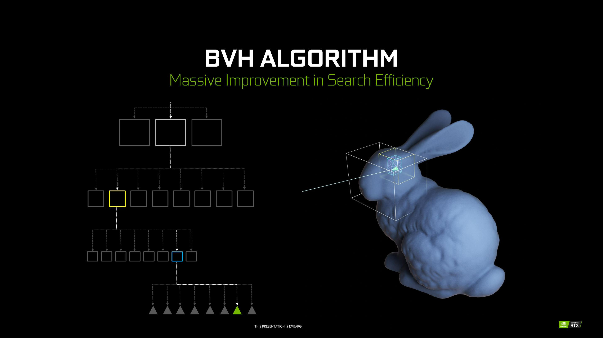
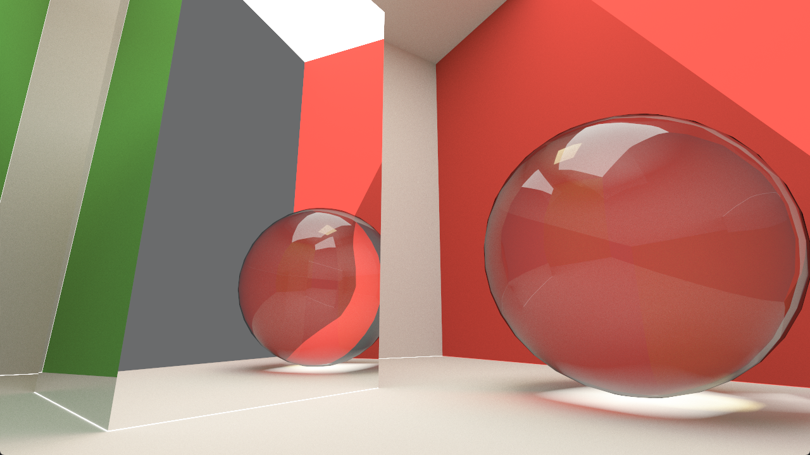
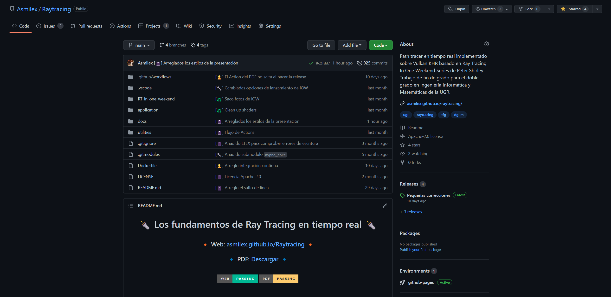

```{r setup, include=FALSE}
library(RefManageR)
BibOptions(
  check.entries = FALSE,
  #bib.style = "authoryear",
  cite.style = "numeric",
  style = "markdown",
  hyperlink = FALSE,
  dashed = FALSE
)
bib <- ReadBib("../chapters/bibliography.bib", check = TRUE)
```

# Objetivos del trabajo

- Análisis de algoritmos de visualización 3D **basados en Monte Carlo**.

- **Diseño e implementación de un path tracer** físicamente realista por GPU.
  - Debe ser capaz de muestrear directamente las fuentes de iluminación.

- Estudiar el **tiempo de ejecución** y el error en la **reconstrucción de la imagen**.

- **Comparación** del motor con una implementación en CPU.

- Investigación de las técnicas modernas y el futuro del área.

---

# ¿Cómo se renderiza una imagen por ordenador?

**Rasterización**: proyecta la geometría de la escena en una malla bidimensional de píxeles.

.center[
```{r, echo = FALSE, out.width = "600px"}

```
]

---

.pull-left[
## Ventajas

- Computacionalmente **muy barato**.
- Gran conocimiento por parte de la industria.
]

--

.pull-right[
  ## Donde falla

  - Técnicamente limitado.
  - Genera **imágenes físicamente poco realistas**: no puede calcular iluminación, reflejos, etc. con facilidad.

  $\rightsquigarrow$ necesidad de crear *hacks*.
]

--

.pull-left[

¿Sombra? `r AutoCite(bib, "lumen")`
]
.pull-right[


¿Reflejos? `r AutoCite(bib, "df-spiderman")`
]

---
class:inverse middle center

# **Ray tracing**
## la panacea de la informática gráfica

---

# ¿Qué es ray tracing?

En vez de proyectar la geometría, lanza rayos y hazlos impactar con los objetos de la escena.

En cada impacto, obtén información del objeto y su entorno.

.center[
```{r, echo = FALSE, out.width = "600px"}

```
]

---

# Path tracing

Una forma de ray tracing recursivo. Tras cada impacto, sigue generando rayos recursivamente.


---

# La ecuación del transporte de luz

*Rendering equation* en inglés. Propuesta por Kajiya en 1986 `r AutoCite(bib, "kajiya")`.

$$L_o(p, \omega_o) = L_e(p, \omega_o) + \int_{\mathbb{S}^2}{f(p, \omega_o \leftarrow \omega_i) L_i(p, \omega_i) \lvert \cos\theta_i \rvert d\omega_i}$$

--

- $L(p, \omega)$, **radiancia espectral**. Irradiancia $E(p, \omega)$ por unidad de ángulo sólido $d\omega$ asociado a una dirección $\omega$:

$$L(p, \omega) = \frac{dE_\omega(p)}{d\omega} = \frac{d^2\Phi(p, \omega)}{d\omega\ dA^\bot}  (\text{W sr}^{-1}\text{m}^{-1})$$

.center[
```{r, echo = FALSE, out.width = "370px"}

```
]

---

# La ecuación del transporte de luz

*Rendering equation* en inglés. Propuesta por Kajiya en 1986 `r AutoCite(bib, "kajiya")`.

$$L_o(p, \omega_o) = L_e(p, \omega_o) + \int_{\mathbb{S}^2}{f(p, \omega_o \leftarrow \omega_i) L_i(p, \omega_i) \lvert \cos\theta_i \rvert d\omega_i}$$

- $L(p, \omega)$, **radiancia espectral** $\rightsquigarrow$ Cantidad de luz en un punto $p$ hacia una dirección $\omega$.

--

  - $L_e(p, \omega_o)$: radiancia **emitida** por el material desde $p$ en la dirección $\omega_o$
  - $L_i(p, \omega_i)$: radiancia **incidente** en $p$ desde la dirección $\omega_i$.
  - $L_o(p, \omega_o)$: radiancia **de salida** desde $p$ hacia $\omega_o$.

--

- $f(p, \omega_o \leftarrow \omega_i)$: *Bidirectional Scattering Distribution Function* (BSDF). Proporción de luz procedente de $\omega_i$ y sale hacia $\omega_o$.

.center[
```{r, echo = FALSE, out.width = "600px"}
knitr::include_graphics("./img/BSDF.jpg")
```
]

---

# La ecuación del transporte de luz

*Rendering equation* en inglés. Propuesta por Kajiya en 1986 `r AutoCite(bib, "kajiya")`.

$$L_o(p, \omega_o) = L_e(p, \omega_o) + \int_{\mathbb{S}^2}{f(p, \omega_o \leftarrow \omega_i) L_i(p, \omega_i) \lvert \cos\theta_i \rvert d\omega_i}$$

- $L(p, \omega)$, **radiancia espectral** $\rightsquigarrow$ Cantidad de luz en un punto $p$ hacia una dirección $\omega$.

  - $L_e(p, \omega_o)$: radiancia **emitida** por el material desde $p$ en la dirección $\omega_o$
  - $L_i(p, \omega_i)$: radiancia **incidente** en $p$ desde la dirección $\omega_i$.
  - $L_o(p, \omega_o)$: radiancia **de salida** desde $p$ hacia $\omega_o$.

- $f(p, \omega_o \leftarrow \omega_i)$: *Bidirectional Scattering Distribution Function* (BSDF). Proporción de luz procedente de $\omega_i$ y sale hacia $\omega_o$.

- Recinto de integración $\Omega \subset \mathbb{S}^2$. Usualmente, $H^2(\mathbf{n})$, hemisferio que engloba a la normal $\mathbf{n}$ en $p$.

--

- $\lvert \cos\theta_i \rvert = \left \vert \omega_i \cdot \mathbf{n} \right \vert$, con $\mathbf{n}$ normal en $p$.

---

# La ecuación del transporte de luz

$$L_o(p, \omega_o) = L_e(p, \omega_o) + \int_{H^2(\mathbf{n})}{f(p, \omega_o \leftarrow \omega_i) L_i(p, \omega_i) \cos\theta_i\ d\omega_i}$$

```{r, echo = FALSE}
knitr::include_graphics("./img/ETL.jpg")
```


---
class: center middle

# La ecuación del transporte de luz

¿Cómo estimamos su valor?

---
class: inverse center middle

# Monte Carlo al rescate

---

Las técnicas de Monte Carlo permiten calcular integrales numéricamente mediante muestreo aleatorio.

--

Queremos calcular

$$I = \int_S f(x) dx$$

con $f: S\subset \mathbb{R}^d \rightarrow \mathbb{R}$.

---

# Fundamento teórico

En esencia, esta teoría se basa en dos teoremas `r AutoCite(bib, "mcbook")`:

--

- **Ley del estadístico inconsciente**: $X$ variable aleatoria con función de densidad de probabilidad $p_X$, $g$ función medible

$$E\left[g(X)\right] = \int_{-\infty}^{\infty}{g(x) p_X(x) dx}$$

--

- **Ley (fuerte) de los grandes números**: $X_1, \dots, X_N$ muestras de una v.a. $X \sim p_X$ con esperanza $E[X] = \mu$

$$P\left[\lim_{N \to \infty}{\frac{1}{N} \sum_{i = 1}^{N}{X_i}} = \mu \right] = 1$$

---

# Vale, ¿y cómo lo hacemos?

Queremos evaluar $I = \int_a^b{f(x)dx}$ `r AutoCite(bib, "pellacini-marschner-2017")`.

--

Por la ley del estadístico inconsciente, $E\left[g(X)\right] = \int_{a}^{b}{g(x) p_X(x) dx}$.

--

Dicha esperanza puede estimarse como $E\left[g(X)\right] \approx \frac{1}{N} \sum_{i = 1}^{N}{g(X_i)} =: \hat{I}_N$.

--

Poniendo $g(x) = \frac{f(x)}{p_X(x)}$ con $p_X(x) = \frac{1}{b - a}$ función de densidad uniforme.

--

Obtenemos que

$$E\left[g(x)\right] = \int_{a}^{b}{\frac{f(x)}{p_X(x)}p_X(x) dx} = \int_a^b{f(x)dx} = I$$

--

Y por lo tanto,

$$I \approx \frac{1}{N} \sum_{i = 1}^{N}{\frac{f(X_i)}{p_X(X_i)}} = \frac{b-a}{N}\sum_{i = 1}^{N}{f(X_i)}$$

---

# Propiedad de la integración de Monte Carlo

**El estimador funciona en cualquier dimensión**. Basta con cambiar desde qué distribución se muestrea.

--

El error viene dado por

$$\text{error} = \sqrt{Var\left[\hat{I}_N\right]} = \frac{\sqrt{Var\left[g(X)\right]}}{\sqrt{N}}$$

**¡No depende de la dimensión del integrando!**

--

Opciones para reducir el error:

--

**1. Aumentar el número de muestras** $N$.

--

$\rightsquigarrow$ Para reducir el error a la mitad, habría que tomar 4 veces más muestras.

--

**2. Reducir** $Var\left[g(X)\right]$.

--

$\rightsquigarrow$ Muestreo por importancia: buscar funciones de densidad $p_X(x)$ cercanas a $f(x)$.


---

# Ecuación del transporte de luz aproximada por Monte Carlo


$$\begin{aligned}
L(p, \omega_o) & = L_e(p, \omega_o) + \int_{H^2(\mathbf{n})}{f(p, \omega_o \leftarrow \omega_i)L_i(p, \omega_i)\cos\theta_i} d\omega_i
\end{aligned}$$

---

# Ecuación del transporte de luz aproximada por Monte Carlo


$$\begin{aligned}
L(p, \omega_o) & = L_e(p, \omega_o) + \int_{H^2(\mathbf{n})}{f(p, \omega_o \leftarrow \omega_i)L_i(p, \omega_i)\cos\theta_i} d\omega_i \\
                 & \approx L_e(p, \omega_j) + \frac{1}{N} \sum_{j = 1}^{N}{\frac{f(p, \omega_o \leftarrow \omega_j) L_i(p, \omega_j) \cos\theta_j}{P\left[\omega_j\right]}}
\end{aligned}$$

--

$P\left[\omega_j \right]$: Probabilidad de escoger la dirección $\omega_j$.

--

¿Qué dirección $\omega_j$ escogemos?

--

Utilizar información de...

- El material de la superficie.
- Luces del entorno.

---
class: inverse middle center

# Implementación de un path tracer en tiempo real por GPU

---

# ¿Qué necesitamos?

.pull-left[
- Una gráfica de última generación.

$\quad \rightsquigarrow$ Nvidia RTX 2070 Super.
]
.pull-right[
```{r, echo = FALSE, out.width = "270px"}
knitr::include_graphics("./img/2070S.png")
```
]

--

.pull-left[
- Una API que soporte dicha gráfica.

$\quad\rightsquigarrow$ Vulkan con KHR bindings `r AutoCite(bib, "vulkan")`.
]
.pull-right[
```{r, echo = FALSE, out.width = "320px"}
knitr::include_graphics("./img/Vulkan.png")
```
]

--

.pull-left[
- Un framework para facilitarnos el trabajo.

$\quad\rightsquigarrow$ Nvidia DesignWorks `nvpro-samples` `r AutoCite(bib, "nvpro-samples")`.
]
.pull-right[
```{r, echo = FALSE, out.width = "350px"}

```
]

---

# Cómo funciona ray tracing acelerado por hardware

- La geometría se carga en la GPU gracias a la API.
- Objetos de la escena englobados en estructuras de aceleración $\rightsquigarrow$ **Bounding Volume Hierarchy**.

.center[
```{r, echo = FALSE, out.width = "680px"}

```
]

---

# Cómo funciona ray tracing acelerado por hardware

- La geometría se carga en la GPU gracias a la API.
- Objetos de la escena englobados en estructuras de aceleración $\rightsquigarrow$ **Bounding Volume Hierarchy**.
- Cálculos de intersecciones realizados en núcleos específicos para ray tracing.
- Comportamiento controlado mediante **shaders**

--

## Shaders

Programa que corre en la tarjeta gráfica.

--

Tipos:

- **Ray generation**: inicio de los caminos de rayos.
- **Closest hit**: en la primera intersección con una geometría válida.
- **Any hit**: en cualquier intersección.
- **Miss**: el rayo se pierde en el infinito.

`r AutoCite(bib, "Haines2019")` `r AutoCite(bib, "Marrs2021")`

---
class: middle center

# La **Shader Binding Table**


---
class: inverse middle center

# Demostración de nuestro ray tracer

```{r, echo = FALSE, out.width = "620px"}

```

---

# Iluminación global

Fotones rebotando en una habitación influencian al entorno.

<video controls autoplay muted loop>
  <source src="./img/GI.mov" type="video/mp4">
</video>

---

# Número de muestras

Dispara $N$ rayos por píxel y combina el resultado.

<video controls autoplay muted loop>
  <source src="./img/Muestras.mov" type="video/mp4">
</video>

---

# Profundidad máxima de un rayo

Rebotes máximos permitidos.

<video controls autoplay muted loop>
  <source src="./img/Depth.mov" type="video/mp4">
</video>

---

# Acumulación temporal

Mezclar los últimos frames mientras la cámara no esté en movimiento.

<video controls autoplay muted loop>
  <source src="./img/Acum.mov" type="video/mp4">
</video>

---

# ¿Qué hemos aprendido?

- El color de un píxel en ray tracing puede calcularse mediante la ecuación del transporte de luz.

--

- Podemos estimar su valor mediante integración de Monte Carlo.

--

- Reducir el error del estimador $\Rightarrow$ reducir el ruido de la imagen.

--

- Ray tracing en tiempo real requiere de una GPU moderna y una API gráfica específica.

--

- <u>No se trata del número de muestras, sino *qué* muestras usamos</u>.

---

## Código y memoria

El código y la documentación puede encontrarse en el repositorio de Github.



.center[
https://github.com/Asmilex/Raytracing/
]


---
class: middle center

Fin.

---

# Referencias

```{r, results='asis', echo=FALSE}
PrintBibliography(bib, start = 1, end = 6)
```

---

```{r, results='asis', echo=FALSE}
PrintBibliography(bib, start = 7)
```
